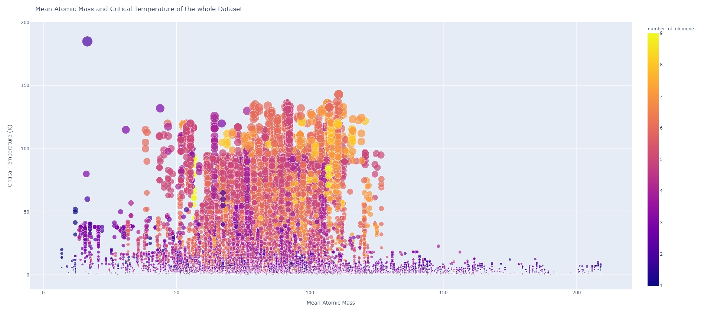
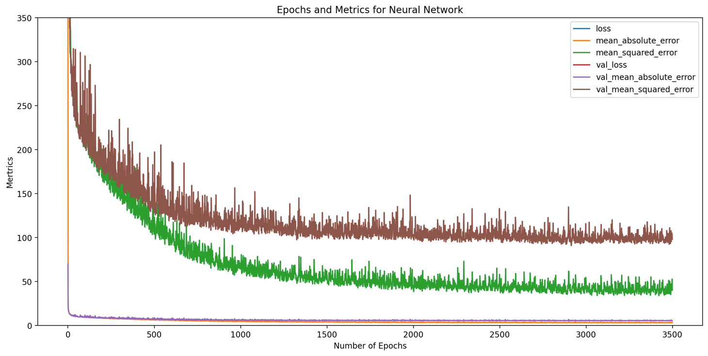
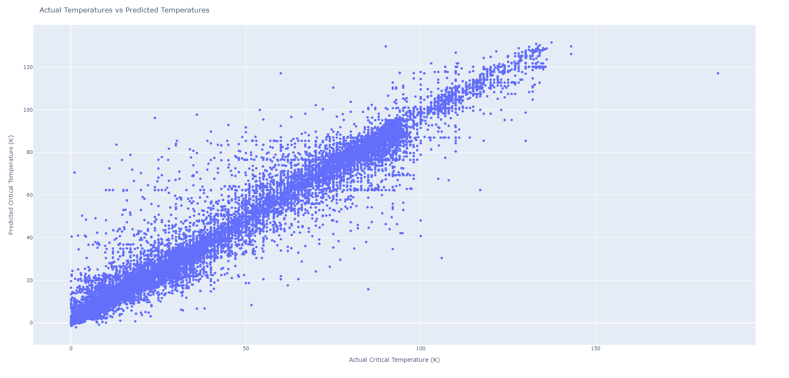

# Superconductor Analysis And Prediction

## Introduction
Superconductivity is a phenomenon where a charge can move through a material without any resistance. This allows electricity to be conducted at maximum efficiency.  However, they need to super-cooled to near 0 Kelvin for the materials to overcome a pair of electrons repulsion and become Cooper pairs. Given this low state of energy, the identity of an induvidual electron becomes uncertain and pass throught the sea of electrons in the super cooled material. The warmest superconductor that currently exists was made in the Planck Institute of Chemistry was made with Lanthium Hydride (LaH10)  that has said to be observed at -23 degrees C or 205K which is warmer than the North Pole. Superconductors have their uses in MRI scanners, NMR Machines and partical accelerators.

 [source](https://vajiramias.com/current-affairs/superconductivity/5cea6a021d5def3dd9b17c7b/)

Here is the dataset I used Visualised.  On the Streamlit app, it is far more detailed and interactive.



## Method
A series of Machine Learning and AI techniques were used to analyse and predict the critical temperature of the material. Linear reqgression was the obvious choice and the features of the dataset correlates either directly or indicrectly to the target. Using TensorFlow, a NN (Neural Network) was made to be like a Multivariate Regression model. Four hidden layers were made for this model and was compiled with and Adam optimizer.  3500 epochs were performed and the best NN was saved and exported.  The Metrics used were MAE and MSE.
```
X = df.drop(['critical_temp', 'material'], axis=1)
y = df['critical_temp'].values.reshape(-1,1)

X_train, X_test, y_train, y_test = train_test_split(X, y, 
                                        test_size=0.2, random_state=42)

model = Sequential()
model.add(Dense(128, input_shape=(X_train.shape[1],), activation='relu'))
model.add(Dense(256, activation='relu'))
model.add(Dense(512, activation='relu'))
model.add(Dense(1024, activation='relu'))
model.add(Dense(1024, activation='relu'))
model.add(Dense(1, activation='linear'))

model.compile(loss='mean_squared_error',
            optimizer='adam',
            metrics=['mae', 'mse']
             )


checkpoint_cb = keras.callbacks.ModelCheckpoint("my_keras_model.h5", save_best_only=True)


history = model.fit(X_train, y_train, epochs=3500,
                    validation_data=(X_test, y_test),
                    batch_size=1024,
                    callbacks=[checkpoint_cb])


model = keras.models.load_model("my_keras_model.h5") # rollback to best model
mse_test = model.evaluate(X_test, y_test)
```
## Results
The NN gave a r-squared value of 96.11%. This was achieved after 3500 epochs of training with 4 hidden layers.  TensorFlow selected the best model based on the metrics specified. Below is a graph that is on the web app that shows how accurate the model gets per epoch.



Below the graph contains the the actual temperature of the super conductors and the predicted temerpatures. There is a correlation to be seen and there are outliers in the data, however it is mostly accurate.




We can see that the MSE and MAE gets lower over time.  This can be seen more easily with the MSE in this case.  The overall results can be seen on a Streamlit app that is currently deployed on Heroku and can be accessed by anyone.  

[Heroku Site](https://superconductor-analysis.herokuapp.com/)

## Tech Stack

* Python
* TensorFlow
* Sci-Kit Learn
* Pandas
* Plotly
* Matplotlib
* Numpy
* Streamlit
